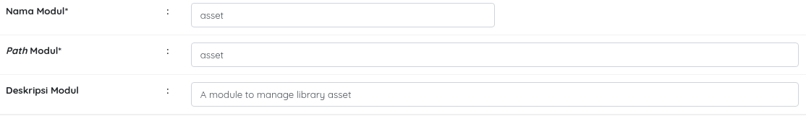

# slims-module-asset
A module for manage library asset

# Cara Install
1. Setelah di download, ubah nama folde rnya menjadi asset.
2. Letakan pada folder admin/modules
3. Masuk ke bagian admin lalu masuk menu system
4. Buka menu module, klik tambah module
5. isian untuk nama module sebagai berikut 

6. Lalu klik Simpan
